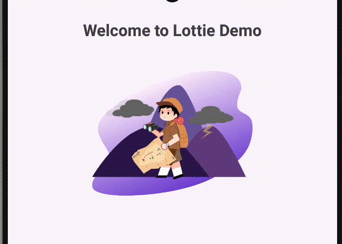
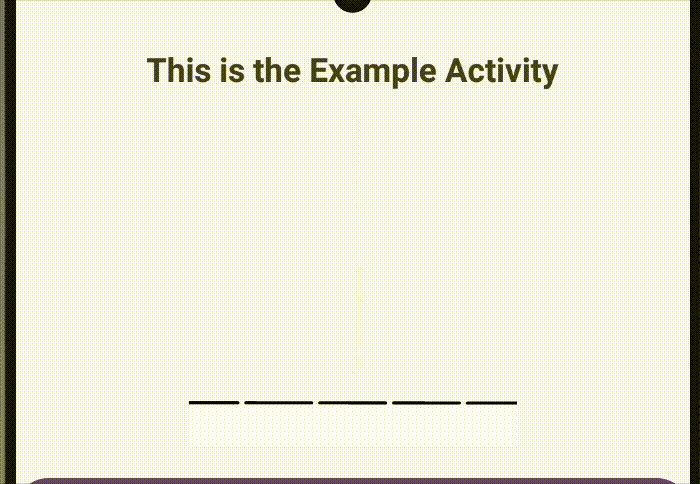

# Lottie Android 🎨

## Zakaj? 🤔
Lottie Android je knjižnica za animacije, ki omogoča preprosto integracijo in prikazovanje animacij v aplikacijah za Android. Knjižnica podpira **JSON animacije**, ustvarjene v orodju Adobe After Effects. Primerna je za uporabo zaradi svoje **učinkovitosti**, preprostosti in široke podpore. Doda "poseben" učinek aplikaciji.

---

## Prednosti ✅
- **Preprosta uporaba** in integracija
- Podpira kompleksne animacije brez večjega vpliva na zmogljivost aplikacije
- Aktivna skupnost in veliko primerov uporabe
- Podpira "funkcionalne" kot "estetske" animacije.

---

## Slabosti ❌
- Kompleksna integracija "funkcionalnih" animacij
- Možne težave s performansom pri zelo kompleksnih animacijah
- Potreba po skrbni optimizaciji JSON animacij za najboljšo uporabniško izkušnjo

---

## Licenca 📜
Lottie je na voljo pod **Apache 2.0 licenco**, kar omogoča uporabo tako za komercialne kot nekomercialne projekte. Več informacij o licenci najdete [tukaj](https://github.com/airbnb/lottie-android/blob/master/LICENSE).

---

## Število zvezdic, forkov ⭐
- **Stars:** 35.1k
- **Forks:** 5.4k

---

## Vzdrževanje projekta 🔧
- **Zadnja posodobitev:** 4.12.2024
- **Število razvijalcev:** 160

---

## Primeri uporabe 📂
### Preprost prikaz animacije

```xml
<com.airbnb.lottie.LottieAnimationView
    android:id="@+id/mainLottie"
    android:layout_width="200dp"
    android:layout_height="200dp"
    app:lottie_rawRes="@raw/page_not_found"
    app:lottie_autoPlay="true"
    app:lottie_loop="true"
    app:layout_constraintTop_toBottomOf="@id/welcomeText"
    app:layout_constraintStart_toStartOf="parent"
    app:layout_constraintEnd_toEndOf="parent"
    android:layout_marginTop="16dp" />
```



### Animiran prehod 
