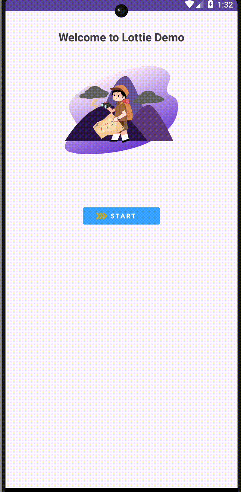

# Lottie Android 🎨

## Zakaj? 🤔
Lottie Android je knjižnica za animacije, ki omogoča preprosto integracijo in prikazovanje animacij v aplikacijah za Android. Knjižnica podpira **JSON animacije**, ustvarjene v orodju Adobe After Effects. Primerna je za uporabo zaradi svoje **učinkovitosti**, preprostosti in široke podpore. Doda "poseben" učinek aplikaciji.

---

## Prednosti ✅
- **Preprosta uporaba** in integracija
- Podpira kompleksne animacije brez večjega vpliva na zmogljivost aplikacije
- Aktivna skupnost in veliko primerov uporabe
- Podpira "funkcionalne" kot "estetske" animacije.

---

## Slabosti ❌
- Kompleksna integracija "funkcionalnih" animacij
- Možne težave s performansom pri zelo kompleksnih animacijah
- Potreba po skrbni optimizaciji JSON animacij za najboljšo uporabniško izkušnjo

---

## Licenca 📜
Lottie je na voljo pod **Apache 2.0 licenco**, kar omogoča uporabo tako za komercialne kot nekomercialne projekte. Več informacij o licenci najdete [tukaj](https://github.com/airbnb/lottie-android/blob/master/LICENSE).

---

## Število zvezdic, forkov ⭐
- **Stars:** 35.1k
- **Forks:** 5.4k

---

## Vzdrževanje projekta 🔧
- **Zadnja posodobitev:** 4.12.2024
- **Število razvijalcev:** 160

---

## Primeri uporabe 📂
### Preprost prikaz animacije
---

```xml
<com.airbnb.lottie.LottieAnimationView
    android:id="@+id/mainLottie"
    android:layout_width="200dp"
    android:layout_height="200dp"
    app:lottie_rawRes="@raw/page_not_found"
    app:lottie_autoPlay="true"
    app:lottie_loop="true"
    app:layout_constraintTop_toBottomOf="@id/welcomeText"
    app:layout_constraintStart_toStartOf="parent"
    app:layout_constraintEnd_toEndOf="parent"
    android:layout_marginTop="16dp" />
```
---

---
### Animiran gumb&prehod 
---

```xml
<!-- Button Animation -->
    <com.airbnb.lottie.LottieAnimationView
        android:id="@+id/lottieButton"
        android:layout_width="320dp"
        android:layout_height="147dp"
        android:layout_marginTop="16dp"
        app:layout_constraintEnd_toEndOf="parent"
        app:layout_constraintStart_toStartOf="parent"
        app:layout_constraintTop_toBottomOf="@id/mainLottie"
        app:lottie_autoPlay="false"
        app:lottie_loop="false"
        app:lottie_rawRes="@raw/button_animation" />
```
---


```xml
<!-- Full-Screen Transition Animation located in activity_main -->
    <com.airbnb.lottie.LottieAnimationView
        android:id="@+id/transitionLottie"
        android:layout_width="match_parent"
        android:layout_height="match_parent"
        app:lottie_rawRes="@raw/transition_animation"
        app:lottie_autoPlay="false"
        app:lottie_loop="false"
        android:scaleType="fitXY"
        android:visibility="gone"
    android:layout_gravity="center"
    android:background="@android:color/white" />
```
---
```kotlin
// Button animation logic
binding.lottieButton.setOnClickListener {
    // Play the button animation
    binding.lottieButton.playAnimation()

    // After button animation ends, show the transition animation
    binding.lottieButton.addAnimatorListener(object : Animator.AnimatorListener {
        override fun onAnimationStart(animation: Animator) {}

        override fun onAnimationEnd(animation: Animator) {
            // Start the transition animation
            binding.transitionLottie.visibility = View.VISIBLE
            binding.transitionLottie.playAnimation()

            // Navigate to the next activity after the transition animation ends
            binding.transitionLottie.addAnimatorListener(object : Animator.AnimatorListener {
                override fun onAnimationStart(animation: Animator) {}

                override fun onAnimationEnd(animation: Animator) {
                    startActivity(Intent(this@MainActivity, ExampleActivity::class.java))
                    finish() // Optionally finish this activity
                }

                override fun onAnimationCancel(animation: Animator) {}

                override fun onAnimationRepeat(animation: Animator) {}
            })
        }

        override fun onAnimationCancel(animation: Animator) {}

        override fun onAnimationRepeat(animation: Animator) {}
    })
}
```
---
### Nalaganje
---

```kotlin
 // Delay for the duration of the Lottie animation
        Handler(Looper.getMainLooper()).postDelayed({
            // Start MainActivity after the animation finishes
            startActivity(Intent(this, MainActivity::class.java))
            finish() // Finish SplashActivity so it's removed from the back stack
        }, 3000) // 3000ms = 3 seconds
```
---
### Uporaba na vajah
---
